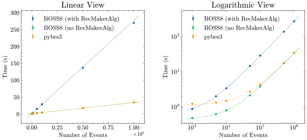

# Documentation for pybes3

`pybes3` is an **unofficial** Python module that aims to make it easier for BES3 users to work with Python.

!!! abstract "Help us improve `pybes3`!"
    If you have any suggestions, questions, or issues, please feel free to open an [issue](https://github.com/mrzimu/pybes3/issues/new/choose).

!!! tip "See Also"
    It is highly recommended to take a look at these Python modules before using `pybes3`:

    - [`awkward`](https://awkward-array.org/doc/stable/index.html): A Python module that can handle ragged-like array.
    - [`uproot`](https://uproot.readthedocs.io/en/stable/): A ROOT I/O Python module. `pybes3` uses `uproot` to read BES3 ROOT files.

<div class="grid cards" markdown>

- <a href="installation" style="text-decoration: none; color: inherit;">
    :material-download: __Install `pybes3`__ using `pip`
  </a>

- <a href="#user-manual" style="text-decoration: none; color: inherit;">
    :material-run-fast: __Get started__ with user manual
  </a>

</div>

## User manual

<div class="grid cards" markdown>

- <a href="user-manual/bes3-data-reading" style="text-decoration: none; color: inherit;">
    :material-import: __BES3 data reading__

    Read `rtraw`, `rec`, `dst`, and even `raw` files.
  </a>

- <a href="user-manual/digi-identifier" style="text-decoration: none; color: inherit;">
    :material-scatter-plot: __Digi identifier__

    Convert digi identifier id number to a human-readable format.
  </a>

- <a href="user-manual/detector/global-id" style="text-decoration: none; color: inherit;">
    :material-identifier: __Global ID__

    Global ID numbers for each detector element in `pybes3`.
  </a>

- <a href="user-manual/detector/geometry" style="text-decoration: none; color: inherit;">
    :material-crosshairs-gps: __Geometry__

    Retrieve and compute geometry information of detectors.
  </a>

- <a href="user-manual/helix" style="text-decoration: none; color: inherit;">
    :material-vector-curve: __Helix operations__

    Parse and transform helix parameters.
  </a>

</div>

## Performance

`pybes3` is designed to be fast and efficient. It uses `numba` to accelerate some of the operations, such as helix operations and digi identifier conversion. When `numba` is not available, `pybes3` falls back to C++ extensions.

### Data reading

A simple benchmark compares the performance of `pybes3` and `BOSS8` in reading `dst` files:

- For `pybes3`, we directly read out the `Event` tree:

    ```python
    import uproot
    import pybes3

    n_evt = ... # number of events to read
    files = [...] # list of ROOT files to read

    data_array = uproot.concatenate({f: "Event" for f in files}, entry_stop=n_evt)
    ```

- For `BOSS8`, reading reconstruction data with the default job-options loads `RecMakerAlg` for each event, which slows down the reading performance significantly (4–5× slower than pure reading). We test 2 cases:

    - A loop on all events **with** `RecMakerAlg` (default job-options):

        ```
        #include "$ROOTIOROOT/share/jobOptions_ReadRec.txt"
        #include "$OFFLINEEVENTLOOPMGRROOT/share/OfflineEventLoopMgr_Option.txt"

        EventCnvSvc.digiRootInputFile = { ... }; // list of ROOT files to read
        ApplicationMgr.EvtMax = ...; // number of events to read
        MessageSvc.OutputLevel = 7; // suppress messages
        ```

    - A loop on all events **without** `RecMakerAlg`. This is similar to reading `rtraw` files and is the closest case to raw ROOT reading:

        ```
        ApplicationMgr.ExtSvc += {"EvtPersistencySvc/EventPersistencySvc"};
        ApplicationMgr.ExtSvc +={"RootEvtSelector/EventSelector","RootCnvSvc/EventCnvSvc"};
        EventPersistencySvc.CnvServices += {"EventCnvSvc"};
        #include "$OFFLINEEVENTLOOPMGRROOT/share/OfflineEventLoopMgr_Option.txt"

        EventCnvSvc.digiRootInputFile = { ... }; // list of ROOT files to read
        ApplicationMgr.EvtMax = ...; // number of events to read
        MessageSvc.OutputLevel = 7; // suppress messages
        ```

The benchmark machine is an Intel i7-12700 with Great Wall GW7000 4TB SSD, running AlmaLinux OS 9 on WSL2. The number of events varies from 1,000 to 1,000,000.

The results are shown below:

<div align="center">
    <picture>
        <source srcset="image/io-benchmarking-dark.svg" media="(prefers-color-scheme: dark)">
        
    </picture>
</div>

The linear fit results are:

<div class="center-table" markdown>
|                            | Initialization time (s) | Slope (s/10k-event) |
| :------------------------: | :---------------------: | :-----------------: |
| BOSS8 (with `RecMakerAlg`) | 0.615                   | 2.766               |
| BOSS8 (no `RecMakerAlg`)   | 0.451                   | 0.338               |
| pybes3                     | 1.135                   | 0.326               |
</div>

The results show that `pybes3` achieves comparable performance to `BOSS8` when `RecMakerAlg` is not loaded—its reading speed is close to raw ROOT I/O. With default `BOSS8` settings (including `RecMakerAlg`), `pybes3` is several times faster. The only exception is very small datasets (~1,000 events), where Python module import and initialization overhead becomes noticeable.
